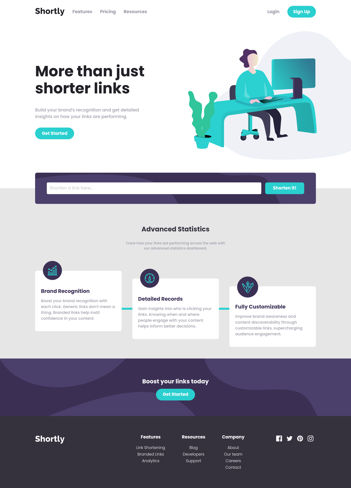

# URL SHORTENING APP WITH REACT

URL Shortening App created with ReactJS, Webpack and Babel

## Overview

- [Used Tools](#used-tools)
- [Screenshots](#screenshots)
- [Links](#links)
- [Author](#author)

## Used Tools

Project design using:
- ReactJS
- Webpack 5
- Babel
- FontAwesome icons
- CSS
- MobileFirst concept

## Screenshots

### Desktop view

### Modal view

### Links

- GitHub pages: [link](https://mperezs06408.github.io/url-shortening-app-react/)

## Author

Created by Santiago Pérez
- Front-end Developer
- **GitHub**: [@mperezs06408](https://github.com/mperezs06408)
- **LinkedIn**: [m.santiagoperez.s](https://www.linkedin.com/in/msantiagoperezs/)